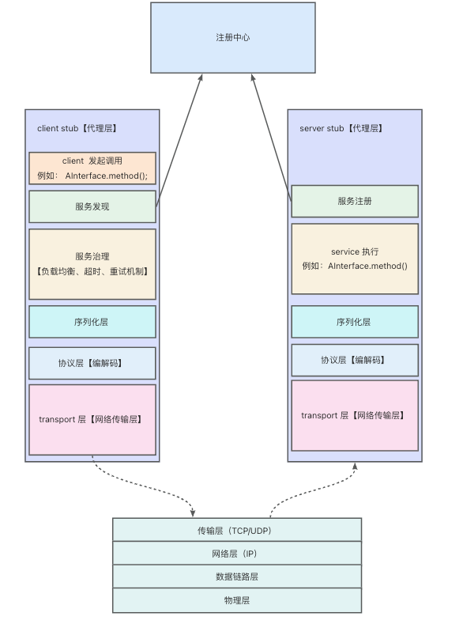
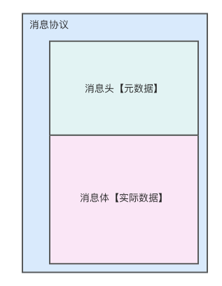

# tiny-rpc

## 1. 前言
rpc 全称: `Remote Procedure Call`，即远程过程调用，能够做到像调用本地服务一样去调用远程函数，屏蔽远程调用的复杂性。

为了能够更好地学习和掌握 rpc，我决定手撕一个 rpc 框架。取名为 `tiny-rpc`.
## 2. 整体架构

### 2.1 client stub
实际上就是客户端代理，屏蔽发起远端调用的细节；封装了发起远端调用的各种步骤，让客户端调用远端就像调用本地一样简单。
#### 2.1.1 服务发现
从注册中心中拉取提供了指定接口的服务列表，需要获取到 ip 信息。
#### 2.1.2 服务治理
* 负载均衡
  * 通过服务发现获取到一批服务列表之后，通过一些策略来决定要调用哪个服务；常见的负载均衡算法有：轮询、随机、最小连接等等
* 超时机制
  * 发起调用的时候，可能会因为各种原因（例如：网络原因、服务器故障等）而导致服务迟迟无法将响应返回，client 不可能无限期的等待下去，调用超过一定时间之后自动放弃该次请求。 
* 重试机制
  * 请求超时之后，可以根据设置的重试策略，重新发起请求 
#### 2.1.3 序列化层
我们服务的结构是对象，是结构对象，但是网络传输的时候，它只认识 0 和 1；而序列化层做的事情就是将我们认识的结构对象转化成计算机认识的二进制流。

例如：
``` 
public Demo class {
    private String a;
}
```
转化成如下方二进制流在网络上进行传输。常见的例如 JSON、Hessian
```
010101110101010111011101....
```
#### 2.1.4 协议层
协议层主要是规定消息协议；即双方约定好的规则，当接收到 client 发送的数据或接收到 server 响应的数据，应该怎么解析；

一般消息协议划分成两部分：1.消息头 2.消息体；如下图所示：



##### a.消息头
存储消息的元数据信息

##### b.消息体
存储消息实际数据
#### 2.1.5 网络传输层
这一层主要是封装网络通讯模块，client 和 server 端如何建立连接进行网络通信。
### 2.2 server stub
服务端代理，接收处理远端请求，将服务信息（例如：ip）上报到注册中心。
### 2.3 注册中心
信息中心，包含所有提供接口服务的服务端信息、同时也包含了客户端消费接口相关信息。

例如：服务器 xxx.xxx.129.12 提供了接口 DemoInterface 服务；有 xxx.xxx.129.10、xxx.xxx.129.29 消费这个接口

## 3. 具体实现
上述是项目整体介绍，下面我将介绍一下每一层实现的具体思路
### 3.1 服务注册与服务发现
#### a.服务注册
定义一个接口，提供 register 方法，用于服务端将需要提供服务的接口上报到注册中心
```java
public interface RpcRegister {

  /**
   * 注册服务
   *
   * @param provider
   * @throws Exception
   */
  void register(RpcProvider provider) throws Exception;
}
```

#### b.服务发现
定义一个接口，提供 discovery 方法，用于客户端从注册中心获取提供了`serviceName` 的服务；
```java
public interface RpcDiscovery {

    /**
     * 发现服务
     *
     * @param serviceName
     * @return
     * @throws Exception
     */
    RpcProvider discovery(String serviceName) throws Exception;
}
```
其中，我们还需要考虑负载均衡，调用 `discovery` 方法不能总是返回其中某一个服务；定义 `RcpLoadBalance` 提供 get 方法，实现支持扩展。
```java
public interface RcpLoadBalance {

    /**
     * 从 providers 返回其中一个 providers
     *
     * @param providers
     * @return
     */
    RpcProvider get(List<RpcProvider> providers);
}
```
### 3.2 编解码
#### a. client 编码
#### b. server 解码

### 3.3 序列化层
序列化将我们的 Object 转化成二进制字节流在网络中传输，常见的序列化算法有：
* jdk 原生序列化
* hessian2
* json
* protocol buffers

定义 `RpcSerialization` 接口，其中包含序列化方法和反序列化方法：
```java
public interface RpcSerialization {
    /**
     * 序列化
     *  
     * @param obj
     * @param <T>
     * @return
     * @throws IOException
     */
    <T> byte[] serialize(T obj) throws IOException;

    /**
     * 反序列化
     *  
     * @param data
     * @param clz
     * @param <T>
     * @return
     * @throws IOException
     */
    <T> T deserialize(byte[] data, Class<T> clz) throws IOException;
}
```
支持自定义选择序列化算法；

###